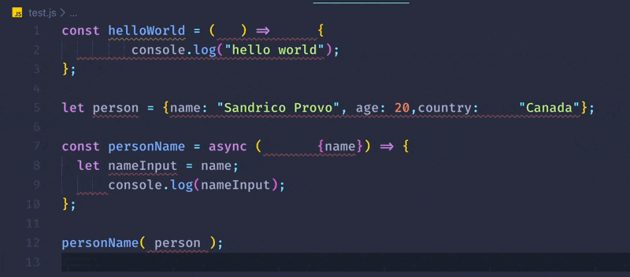

# Eslint & Prettier Configuration

Eslint is awesome because it helps you write consistent code within a project by alerting you to error/mistakes within your code that you've asked it to warn you about, and it'll also fix those issues if you have the write set up. Along with detecting errors, I also like to use the Prettier plugin which helps style your code consistantly. Want to make sure you have spaces arround destructured elements and that you always use single or double quotes, Prettier has your back!

I always found myself having to configure this project by project because I didn't have a single source of truth for my configure, and that why I made this set configu project.

Here's how I have this set up currently:

**Visual Studio Code**

- [Eslint Extenstion](https://marketplace.visualstudio.com/items?itemName=dbaeumer.vscode-eslint)
- [Prettier Extension](https://marketplace.visualstudio.com/items?itemName=esbenp.prettier-vscode)

**Package.json dev/peer dependencies**

To see what packages I've installed check out my [package.json](package.json) file!

Here's an example gif of what the linting looks like on save.


## How to Install

If you want to install this configuration in your next project, follow the steps below:

**Step 1:**
Install the dependencies

```javascript
  npm install-peerdeps --dev eslint-config-sandricoprovo
```

**Step 2:**
Extend the eslintrc into your own eslintrc file

1. Create a .eslintrc file in your project root
2. Add the following code to your new rc file:

```javascript
{
  "extends": [
    "sandricoprovo"
  ]
}
```
